# AmbientModules — User Manual

**AmbientModules** is a small collection of VCV Rack / Cardinal modules inspired by the [Elta Music](https://www.eltamusic.com) [ **SOLAR 42F** "Ambient Drone Machine"](https://www.eltamusic.com/solar-42f)  — an analogue microtonal drone synthesizer. Rather than reproducing the SOLAR 42F's fixed hardware layout, each of its sound engines is broken out here into an independent, freely-patchable Rack module:

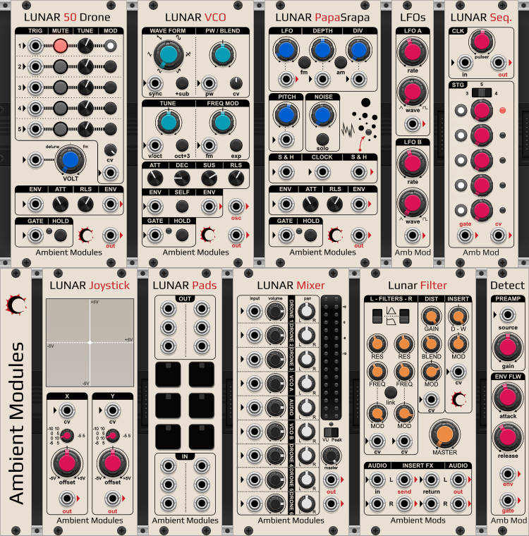

| Module                            | What it does                                       | SOLAR 42F equivalent                       |
|-----------------------------------|----------------------------------------------------|--------------------------------------------|
| [Blank](#blank)                   | Blank panel                                        | —                                          |
| [Lunar50Drone](#lunar50drone)     | 5-oscillator sawtooth drone with a shared envelope | Drone voices 1, 2, 4, 5 "Classic Solar 50" |
| [LunarVCO](#lunarvco)             | AS3340-style VCO with ADSR and hard sync           | Voices "VCO A / VCO B"                     |
| [LunarPapaSrapa](#lunarpapasrapa) | FM/AM cross-modulated noise/drone voice            | Drone voices 3, 6 "Papa Srapa"             |
| [LunarLFO](#lunarlfo)             | Dual unipolar triangle/square LFO                  | LFOs                                       |
| [LunarSequencer](#lunarsequencer) | 3-to-5-stage Buchla-inspired CV/gate sequencer     | Sequencer                                  |
| [LunarPads](#lunarpads)           | 6-pad momentary/latching gate source for the drone voices | "DRONE KEYS" pushbutton grid        |
| [LunarMixer](#lunarmixer)         | 9-channel panoramic mixer with master level        | Mixer page                                 |
| [LunarJoystick](#lunarjoystick)   | Draggable XY pad / CV position source, per-axis range + offset | Joystick block                  |

## Table of Contents

- [Videos](#videos)
- [Solar 42f patch](#solar-42f-patch)
- [Panel themes](#panel-themes)
- [Right-click menu](#right-click-menu)
- [Shared conventions](#shared-conventions)
- [Lunar50Drone](#lunar50drone)
- [LunarVCO](#lunarvco)
- [LunarLFO](#lunarlfo)
- [LunarPapaSrapa](#lunarpapasrapa)
- [LunarSequencer](#lunarsequencer)
- [LunarPads](#lunarpads)
- [LunarMixer](#lunarmixer)
- [LunarJoystick](#lunarjoystick)
- [Blank](#blank)

## Videos

- [Lunar 42 VCV Rack modules - Cinematic performance](https://youtu.be/Ja0lZwwcWLM) — a live patch using Lunar50Drone, LunarVCO, and LunarLFO; inspired by [JayHosking's original "Solar 42F synth - Cinematic performance"](https://www.youtube.com/watch?v=wQyHPJ56aNg).
- [Lunar 42 VCV Rack modules - Cinematic Ambient](https://youtu.be/l4NEwDLc4YI) — a live patch using Lunar50Drone, LunarVCO, LunarLFO, and LunarSequencer; inspired by [JayHosking's original "Cinematic Ambient (part 1)"](https://www.youtube.com/watch?v=45tY-e7fdm4).

## Solar 42f patch

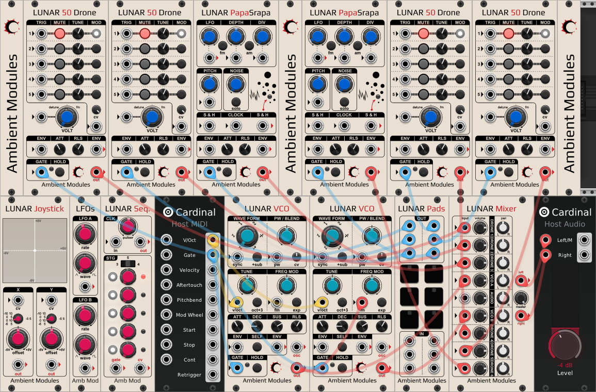

[**Solar42-patch.vcv**](patches/Solar42-patch.vcv) — a full-rack patch reassembling the SOLAR 42F's own architecture out of these modules: 4× Lunar50Drone (Drone 1/2/4/5, Oscillator mix set to *Fixed sum / 5 (legacy)* to match the real hardware's mixing) and 2× LunarPapaSrapa (Drone 3/6) gated from LunarPads, 2× LunarVCO (VCO A/B, cross-modulating each other's FM and both driven from the same MIDI keyboard), all summed through LunarMixer, plus LunarSequencer/LunarLFO/LunarJoystick for modulation. Uses Cardinal's HostMIDI/HostAudio2 for keyboard input and audio output, so it's meant to be opened in Cardinal rather than standalone VCV Rack (drag the file onto the Cardinal window, or File → Open).

## Panel themes

Every AmbientModules panel is available in 5 color themes: **Cream** (default — used for every screenshot in this manual), **Black**, **Pink**, **Yellow**, and **Blue**. Theme is a single pack-wide setting, not per-module: changing it from any one module's right-click menu (see below) instantly re-themes every AmbientModules module already in the patch, and every new one you add afterward starts in that same theme too — it's remembered between sessions.

The full rack of AmbientModules modules, side by side, in each of the 5 available themes:

### Cream

### Black

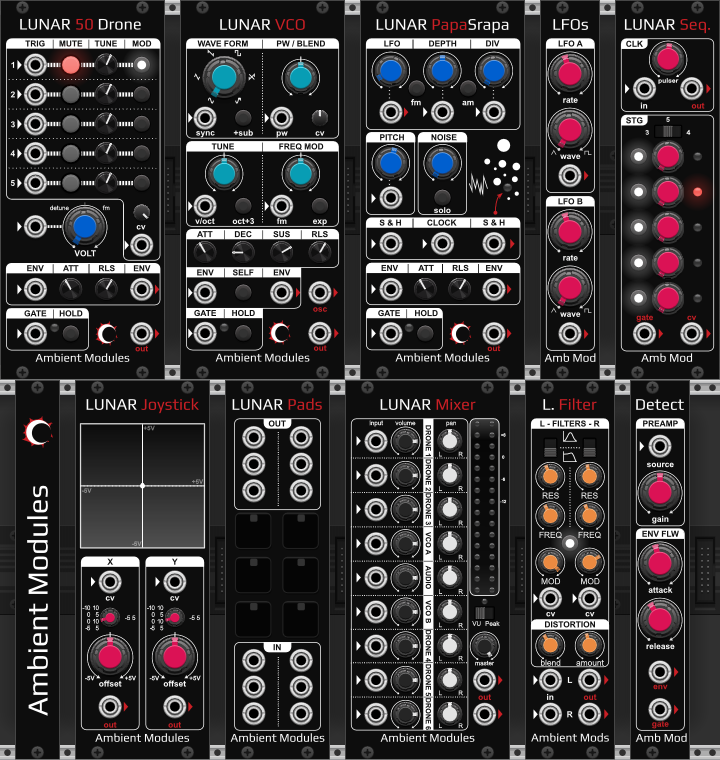

### Pink

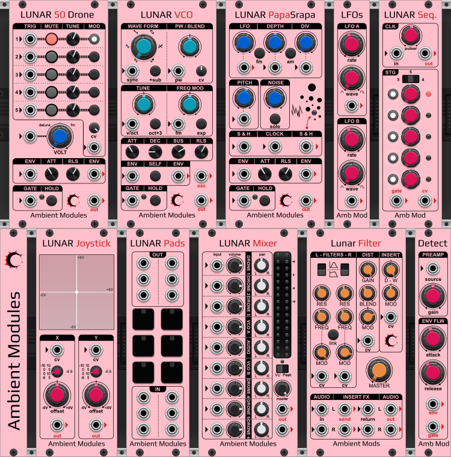

### Yellow

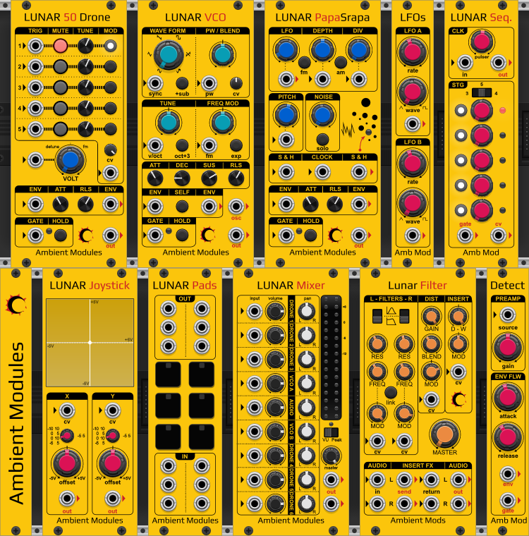

### Blue

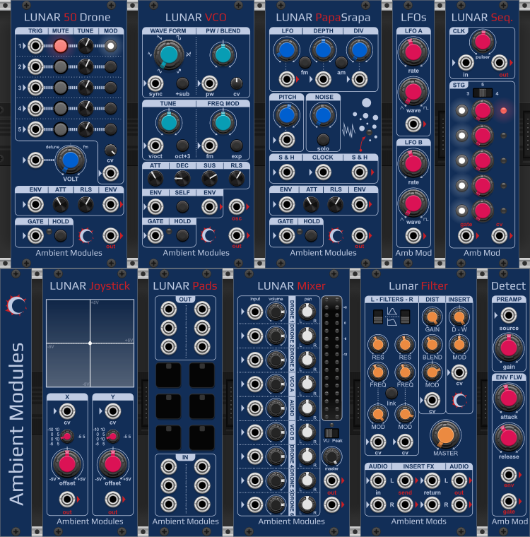

## Right-click menu

Right-click any AmbientModules module to open its context menu. One entry is identical across all 9 modules:

- **Theme** — a submenu to switch the pack-wide panel theme between Cream / Black / Pink / Yellow / Blue (see [Panel themes](#panel-themes) above — it's not specific to the module you right-clicked).

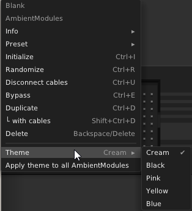

Some modules add extra entries of their own — those are documented under the module in question ([Lunar50Drone](#lunar50drone-context-menu), [LunarLFO](#lunarlfo-context-menu), [LunarSequencer](#lunarsequencer-context-menu), [LunarPads](#lunarpads-context-menu)). LunarVCO, LunarPapaSrapa, LunarMixer, LunarJoystick, and Blank have no module-specific entries.

## Shared conventions

A few behaviors repeat across several modules and are only explained here:

- **V/OCT.** Pitch inputs follow the standard 1 volt per octave convention (0V = C4), like any other Rack oscillator.
- **Polyphony.** Lunar50Drone, LunarVCO, and LunarPapaSrapa are polyphonic: every CV input on their main panel (not just V/OCT/Gate — also Volt CV on Lunar50Drone, FM/Shape CV/Sync on LunarVCO, Modulation depth CV/Divider CV on LunarPapaSrapa) is read independently per channel, and the module's channel count follows whichever of them carries the most channels, or the Envelope CV input if that's higher still. So patching a polyphonic V/OCT or Gate signal (from a polyphonic sequencer, MIDI-to-CV, etc.) anywhere among those inputs, or chaining another module's polyphonic Envelope output into Envelope CV, drives independent voices per channel throughout the module.
- **Envelope CV override.** Lunar50Drone, LunarVCO, and LunarPapaSrapa each have an **Envelope CV** input. When it's patched, it completely replaces that module's internal envelope, its Gate input, and its Hold switch — handy for driving several of these modules from one shared envelope so their amplitudes stay locked together.
- **Hold.** Also shared by those same three modules: a **Hold** switch that, when engaged, forces the envelope open permanently (an "always on" drone) — same effect as holding the Gate input high, and the same switch is overridden the moment the Envelope CV input is patched.

## Lunar50Drone

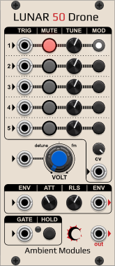

Five simple sawtooth oscillators sharing one output and one envelope — the Classic Solar 50 drone voice. Each of the 5 oscillators can be switched on or off independently to build chords and triads, and the **Volt** knob detunes and then cross-modulates them together for FM-style drone textures, exactly as on the original hardware.

**Knobs & switches**
- **Oscillator 1–5 frequency** — one knob per oscillator, octave-linear tuning centered on C4.
- **Oscillator 1–5 active** (lit button) — mutes/unmutes that oscillator. Can also be toggled from the corresponding trigger input. Not polyphonic: it's a single on/off state per oscillator, shared identically by every poly channel — there's no per-channel "active" state. Oscillator 1 defaults to active, the other four to inactive, so a freshly-added module produces sound immediately instead of silence.
- **Oscillator 1–5 modulation** (lit button) — enables that oscillator's contribution to the cross-modulation described below. Oscillator 1 defaults to on, the other four to off.
- **CV Attenuverter** — scales the incoming Frequency CV (±100%, defaults to +100%) before it's applied to all 5 oscillators together, so it shifts their combined pitch while preserving the intervals between them. ⚠️ Following the real SOLAR 42F, an oscillator only responds to Frequency CV once its own **Modulation** button is enabled — with the attenuverter at its default +100%, enabling Modulation on an oscillator is normally enough on its own; turn the attenuverter down (or all the way to 0%) if you want to reduce or fully disable Frequency CV's effect on every oscillator at once. This gating-by-Modulation-button is by design, not a bug: it mirrors the original hardware's per-oscillator "modulation enable" switch.
- **Volt** — transposes all 5 oscillators down together, independently of the Modulation buttons/CV Attenuverter above; past roughly the halfway point of the knob's travel, they also start frequency-modulating each other (see [Context menu](#lunar50drone-context-menu) for how that cross-modulation is wired), for the same FM synthesis effect described in the original SOLAR 42F documentation.
- **Attack / Release** — the shared envelope applied to the mix.
- **Hold** (lit button) — see [Shared conventions](#shared-conventions).

**Inputs**
- **Frequency CV** — sums (through the CV Attenuverter) onto all 5 oscillators at once.
- **Oscillator 1–5 trigger** — toggles the corresponding oscillator's Active state on a rising edge. Monophonic (channel 1 only, even from a polyphonic cable) — matches the Active button it drives, which isn't per-channel either.
- **Volt CV** — 0–10V, adds to the Volt knob; polyphonic, read independently per channel.
- **Gate** — opens the shared envelope while high (ignored if Hold is engaged or Envelope CV is patched).
- **Envelope CV** — see [Shared conventions](#shared-conventions).

**Outputs**
- **Sawtooth mix** — the combined, enveloped audio output.
- **Envelope** — 0–10V copy of the envelope currently shaping the mix.

**LEDs**
- **Envelope** (yellow, standalone) — brightness follows the envelope's current level, so it glows brighter as the drone swells and dims as it releases.

**Context menu**
- **FM topology** — how the "Modulation"-enabled oscillators cross-modulate once the Volt knob passes its midpoint: *Average of active others* (each modulated oscillator is pushed by the average of the other active oscillators) or *Circular chain* (each one modulates the next in a loop).
- **Oscillator mix** — how the 5 oscillator signals combine into the output level: *Fixed sum / 5 (legacy)* (always divides by 5, so muting oscillators lowers the volume), *Average of active oscillators* (keeps output level constant regardless of how many oscillators are active), or *Soft-clip saturated sum* (sums them and soft-clips, for a driven, denser tone).

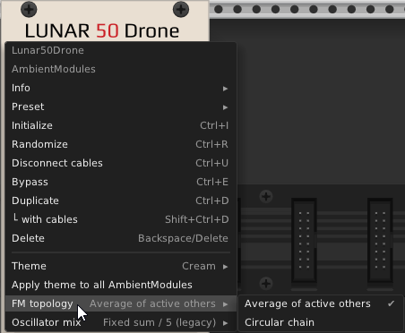 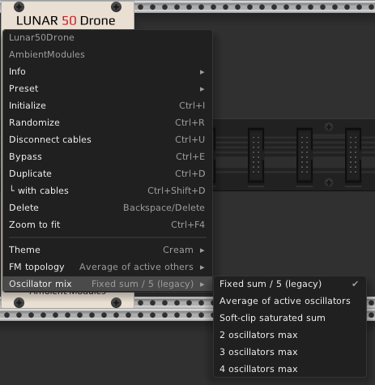

**Patch ideas**
- Patch a slow [LunarLFO](#lunarlfo) into the Frequency CV input for a slowly drifting drone pitch.
- Chain several Lunar50Drone (or other envelope-override-capable modules) together by feeding one's Envelope output into the next's Envelope CV input, so an entire stack of drones swells and releases in unison.

## LunarVCO

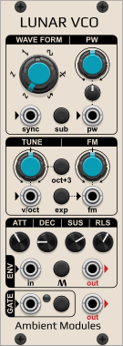

An AS3340-style voltage-controlled oscillator — the SOLAR 42F's "VCO A / VCO B" voice — with 6 waveforms, hard sync, linear or exponential FM, and a full ADSR envelope built in.

**Knobs & switches**
- **Waveform** — 6 positions: Sine, Triangle, Inverted saw, Square, Saw-to-inverted-saw (morphed by Shape), Sine-to-saw (morphed by Shape).
- **Tune** — ±0.5 octave fine tune.
- **Octave** (lit button) — Low or +3 octaves.
- **Sub oscillator** (lit button) — adds a sub-oscillator one octave below.
- **FM mode** (lit button) — Linear or Exponential FM response for the FM input.
- **Shape** — pulse width (square) or morph blend (the two morphing waveforms), plus its CV amount attenuverter.
- **FM amount** — attenuverter for the FM input.
- **Attack / Decay / Sustain / Release** — the built-in ADSR envelope.
- **Hold** (lit button) — see [Shared conventions](#shared-conventions).
- **Self-generation** (lit button) — turns the envelope generator into a free-running LFO instead of a one-shot envelope, cycling Attack/Release only (Decay is skipped); Attack and Release should be turned low (towards 9 o'clock) for this to cycle usefully, and Sustain sets its peak depth. Still needs Gate to have gone high at least once (or Hold engaged) to start — it doesn't cycle on its own from silence.

**Inputs**
- **V/oct** — pitch, standard 1V/octave.
- **FM** — linear or exponential frequency modulation (mode set by the FM mode switch), scaled by the FM amount knob.
- **Shape CV** — modulates the Shape knob, scaled by its attenuverter.
- **Sync** — hard-syncs the oscillator's phase to the incoming signal.
- **Gate** — opens the ADSR envelope while high (ignored if Hold is engaged or Envelope CV is patched).
- **Envelope CV** — see [Shared conventions](#shared-conventions).

**Outputs**
- **Audio Out** — the enveloped (VCA'd) oscillator signal.
- **Envelope Out** — 0–10V copy of the ADSR currently shaping Audio Out.
- **OSC Out** — raw, unenveloped oscillator phase (±5V ramp); mirrors the hardware's VCO B "OSC" output. Patch it into another LunarVCO's Sync input to hard-sync that oscillator to this one.

**LEDs**
- **Envelope** (yellow, standalone) — brightness follows the ADSR's current level, glowing brighter through Attack/Sustain and dimming through Decay/Release.

**Patch ideas**
- Drive V/oct from [LunarSequencer](#lunarsequencer)'s Step CV output for melodic drone runs.
- Enable Self-generation with a slow Attack/Release and Hold engaged to use the envelope itself as a free amplitude LFO with nothing patched into Gate.
- Two LunarVCOs, A and B: patch B's OSC Out into A's Sync input for a classic hard-sync timbre — detune A against B and sweep A's Tune/FM for the sync "sweep" sound.

## LunarLFO

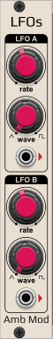

Two independent, unipolar (by default) LFOs — LFO A and LFO B — each blending continuously between a triangle and a square wave.

**Knobs**
- **LFO A / B rate** — octave-spaced rate knobs, one per LFO.
- **LFO A / B wave** — morphs that LFO's shape between triangle and square.

**Inputs:** none.

**Outputs**
- **LFO A** / **LFO B** — each only runs while its output is patched (idle and reset to phase 0 otherwise); voltage range set by CV Range below.

**Context menu**
- **CV Range** — sets the output range shared by both LFO A and B: *0V to +5V* (default, matches the SOLAR 42F hardware), *0V to +10V*, *-5V to +5V*, or *-10V to +10V*.

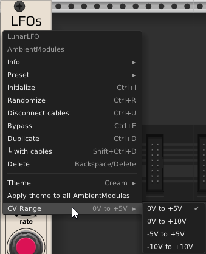

**Patch ideas**
- Patch LFO A into [Lunar50Drone](#lunar50drone)'s Frequency CV, or into [LunarVCO](#lunarvco)'s Shape CV, for slow evolving drone movement.
- Set CV Range to a bipolar range and use LFO B to pan or crossfade elsewhere in the patch.

## LunarPapaSrapa

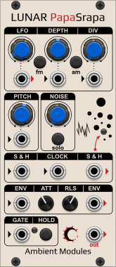

The SOLAR 42F's "Papa Srapa" noise/drone voice: a low-frequency square-wave modulator cross-modulating an audio-rate square oscillator (FM and/or AM), blended with independent white noise, plus a built-in sample & hold and envelope.

**Knobs & switches**
- **Rate** — the modulator's frequency, from 1Hz up to ~C4.
- **FM** (lit button) — routes the modulator into the audio oscillator's frequency.
- **AM** (lit button) — routes the modulator into the audio oscillator's amplitude. FM and AM can be enabled together.
- **Modulation depth** — how strongly the modulator affects the audio oscillator, plus its CV input.
- **Divider** — divides down the modulator's frequency relative to the audio oscillator, plus its CV input.
- **Pitch** — the audio oscillator's pitch, spanning C0 to E7.
- **Noise** — mix level of the internal white noise source, shared across every polyphonic voice (not decorrelated per voice — the real hardware only has one noise generator per module).
- **Noise only** (lit button) — forces a clean white-noise-only output, overriding Pitch/FM/AM/Divider.
- **Attack / Release** — the shared envelope.
- **Hold** (lit button) — see [Shared conventions](#shared-conventions).

**Inputs**
- **Pitch CV** — 1V/oct, sums onto the Pitch knob.
- **Modulation depth CV**, **Divider CV** — sum onto their respective knobs; polyphonic, read independently per channel, each driving its own per-channel modulator (see LFO output below) — so different channels can have their own FM/AM depth and modulator rate.
- **Sample & hold clock** — samples a new value on each rising edge; polyphonic, with its own channel count driven by Sample & hold clock/input (independent from the rest of the panel — see Outputs below).
- **Sample & hold input** — the source to sample; normalled to the internal noise generator when nothing is patched here; polyphonic, same channel count as Sample & hold clock.
- **Gate** — opens the envelope while high (ignored if Hold is engaged or Envelope CV is patched).
- **Envelope CV** — see [Shared conventions](#shared-conventions).

**Outputs**
- **VCO (enveloped)** — the main cross-modulated/noise audio output, shaped by the envelope.
- **LFO** — the raw low-frequency modulator signal, always running while patched; polyphonic — each channel gets its own independent modulator (see Modulation depth CV / Divider CV above), unlike the real hardware's single LFO per module.
- **Sample & hold** — the current sampled value; polyphonic, with its own channel count driven by the Sample & hold Signal/Clock inputs — independent from Pitch CV/Gate/Envelope CV, since S&H is a self-contained section of the panel.
- **Envelope** — 0–10V copy of the envelope currently shaping VCO Out.

**LEDs**
- **Envelope** (yellow, standalone) — brightness follows the envelope's current level.
- **Sample & Hold** (blue, standalone) — flashes with each new sample on channel 1, brightness proportional to that channel's sampled value's magnitude (a single LED can't show all channels at once).

**Patch ideas**
- Turn on both FM and AM with a fast Rate and high Modulation depth for the "sirens and space monsters" sounds the original Papa Srapa circuit is known for.
- Patch [LunarSequencer](#lunarsequencer)'s Clock Out into Sample & hold clock to resample the internal noise once per step, for a random stepped CV source.

## LunarSequencer

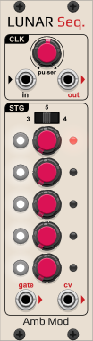

A classic, Buchla-inspired 3-to-5-stage sequential voltage source: each step stores its own CV (0–100%, rescaled to volts by the CV Range setting) and its own gate on/off.

**Knobs & switches**
- **Pulser rate** — speed of the internal clock, used whenever nothing is patched into Clock In. The internal pulser is a clean ~50%-duty square wave (not a ramp/sawtooth) — same shape whether it's driving Clock Out or advancing the steps internally.
- **Stages** — sets the sequence length to 3, 4, or 5 steps. ⚠️ Following the original SOLAR 42F hardware switch (a vertical lever read top to bottom as 4, 5, 3), this module's own horizontal switch reads left to right as **3, 5, 4** rather than the more intuitive 3, 4, 5. Click directly on the side you want (rather than the current lever position) to jump straight there, like a real toggle switch.
- **Step 1–5 CV** — each step's output level; the knob's tooltip shows the actual voltage for the currently selected CV Range.
- **Step 1–5 gate** (lit button) — enables/disables that step's Gate output. This does **not** affect the CV output — a "gate off" step is skipped for triggering, but its CV value still plays when the sequence reaches it.

**Inputs**
- **Clock In** — external clock/trigger; when connected, it replaces the internal Pulser.

**Outputs**
- **Clock Out** — the clock currently driving the sequence (buffered internal Pulser, or a copy of Clock In when connected).
- **Step gate** — the current step's gate: high (10V) whenever the clock is high and that step's Step gate switch is enabled. Always a clean 0V/10V logic level matching the clock's own duty cycle, even with an external Clock In of unusual shape/amplitude — not a raw copy of its voltage (see Clock Out above for that instead).
- **Step CV** — the current step's CV, rescaled into the range set by CV Range.

**LEDs**
- **Step 1–5 gate** (white, built into each Step gate button) — lit while that step's gate output is enabled.
- **Step 1–5 position** (red, standalone, next to each step) — lit on whichever step is currently playing; steps beyond the active Stages count never light up.

**Context menu**
- **CV Range** — sets the Step CV output range: *0V to +5V* (default), *0V to +10V*, *-5V to +5V*, or *-10V to +10V*. Also changes what voltage the Step CV knob tooltips display.

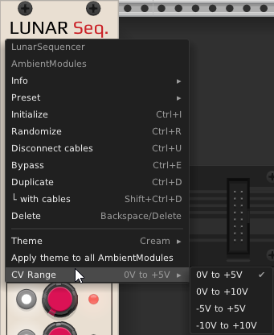

**Patch ideas**
- Feed Step CV into [LunarVCO](#lunarvco) or [Lunar50Drone](#lunar50drone)'s pitch/frequency input, and Step gate into their Gate input, for a self-contained melodic sequence.
- Chain two LunarSequencers by patching one's Clock Out into the other's Clock In to build longer combined patterns.

## LunarPads

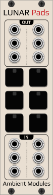

The SOLAR 42F's "DRONE KEYS" pushbutton grid: 6 square pads triggering the 6 drone voices (Drone 1/2/4/5 = [Lunar50Drone](#lunar50drone) "Classic Solar 50", Drone 3/6 = [LunarPapaSrapa](#lunarpapasrapa)). VCO A/B aren't covered here — they already have their own gate/envelope, driven by the touch keyboard on the real hardware.

**Pads**
- **Drone 1–6** (square pad + LED) — triggers that drone voice's gate: momentary by default (gate high only while held, matching the hardware's pushbutton keyboard) or latching (a click toggles it on/off, like a mute button) depending on the Latch mode menu setting below.
- **Ctrl+click** holds one pad down like a second finger, independently of the Latch mode setting — even with Latch mode off (so every other pad still springs back on release), Ctrl-clicking a pad keeps that one held until it's clicked again (with or without Ctrl). A plain click on any pad releases every *other* pad currently held this way, file-explorer-selection style, so you can sustain one or two voices by hand while triggering the rest normally.

**Inputs**
- **Drone 1–6 external gate** — ORs into that pad's own gate (e.g. from MIDI), regardless of Latch mode, so an external source can trigger it alongside the mouse.

**Outputs**
- **Drone 1–6 gate** — 0/10V logic level, high whenever that pad or its external gate input is active.

**Context menu**
- **Latch mode** — unchecked (default): pads are momentary. Checked: clicking a pad toggles it on/off instead of requiring it to be held.

**Patch ideas**
- Patch the gate outputs here into [Lunar50Drone](#lunar50drone)/[LunarPapaSrapa](#lunarpapasrapa)'s Gate input to trigger those drones from this shared pad grid instead of each module's own Gate jack.
- Turn on Latch mode and Ctrl+click a couple of pads to build a sustained drone, then trigger the rest momentarily on top for accents.

## LunarMixer

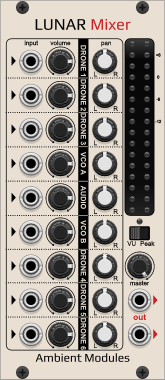

The SOLAR 42F's 9-channel panoramic mixer page: one row per channel (In / Level / Pan), summed to a shared stereo output with a master level knob. Straight sum, no automatic gain compensation or soft-clipping — same as the hardware mixer page and the standard Eurorack mixer convention, so gain-stage with the Level knobs directly.

**Knobs**
- **Drone 1–3, VCO A, Ext. Audio/Preamp, VCO B, Drone 4–6 level** — one knob per channel, 0–100%.
- **Drone 1–3, VCO A, Ext. Audio/Preamp, VCO B, Drone 4–6 pan** — constant-power pan per channel, hard left to hard right.
- **Master level** — overall output level after the pan/sum stage.

**Inputs**
- **Drone 1–3, VCO A, Ext. Audio/Preamp, VCO B, Drone 4–6** — one audio input per channel. A polyphonic cable is summed to mono before that channel's own Level/Pan (same convention as Bogaudio's Mix4 and Venom/MindMeld MixMaster's "poly sum" mode) — each channel has a single pair of knobs, not one per polyphonic voice. "Ext. Audio/Preamp" is a general-purpose channel for anything else you want to mix in; on the real hardware it's mutually exclusive with the internal piezo preamp, a distinction that doesn't apply here.

**Outputs**
- **Left / Right** — the summed, panned, master-level-scaled stereo mix.

**Patch ideas**
- Feed [Lunar50Drone](#lunar50drone), [LunarVCO](#lunarvco) (into VCO A and VCO B), and [LunarPapaSrapa](#lunarpapasrapa) (into Drone 3 and Drone 6) into their matching channels here for one shared stereo output with independent level/pan per voice.

## LunarJoystick

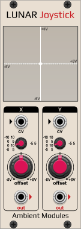

Electrical equivalent of the SOLAR 42F Joystick block, without the physical stick: a draggable XY pad producing independent X/Y position voltages, each either manual (drag the pad) or driven by an external CV, plus a per-axis input-range selector and offset — matching the 3 example ranges in the original manual (offset left/center/right → -10V to 0V / -5V to +5V / 0V to +10V).

**XY pad**
- Click or click-drag anywhere in the square to set X and Y at once — the crosshair jumps straight to wherever you click, unlike a knob's relative turn-style drag. Double-click resets both axes to center (0V).
- While a CV is patched into X In or Y In, that CV drives the corresponding axis instead of the pad — except for the instant you're actively dragging the pad, which briefly takes manual control back so you can override CV in real time; it reverts to CV as soon as you release the mouse.
- If the cursor leaves the square on either axis mid-drag, the crosshair freezes exactly where it crossed the edge rather than sliding along it — further mouse movement outside the zone is ignored until the cursor comes back inside on both axes.

**Knobs**
- **X/Y offset** — adds to that axis's position (manual or CV) after the range rescale below, so it's independent of whichever range is selected.
- **Range X/Y** (4-position rotary) — the voltage range an external CV source is rescaled from, into the pad's internal ±5V range: *-5V to +5V*, *0V to +10V* (default — e.g. a MIDI CC→CV converter, always unipolar 0–10V), *0V to +5V*, or *-10V to +10V*. CV outside the selected range is clamped to ±5V internally, same as a manual drag can never exceed.

**Inputs**
- **X / Y** — CV overriding the pad's manual position on that axis when patched (see above).

**Outputs**
- **X / Y** — the resulting position (manual or CV, rescaled by Range X/Y) plus that axis's offset knob. Lightly smoothed (5ms one-pole lowpass) to remove hard steps from a stepped CV source or a jerky mouse drag — deliberately short enough to be imperceptible by hand, not a real slew/portamento effect; the displayed crosshair itself isn't smoothed, only this output.

**Patch ideas**
- Patch X and Y into two parameters you want to move together by hand (e.g. [Lunar50Drone](#lunar50drone)'s Volt and [LunarVCO](#lunarvco)'s Shape) for a single 2D "macro" control.
- Feed a slow [LunarLFO](#lunarlfo) into X or Y In (Range set to match the LFO's own output range) for a hands-off wandering position you can still grab and override by hand at any time.

## Blank

An empty panel with no parameters, inputs, or outputs — a spacer/template module, not a functional sound source.
